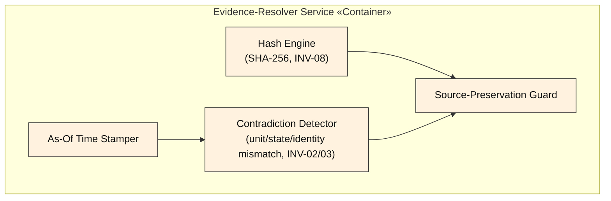
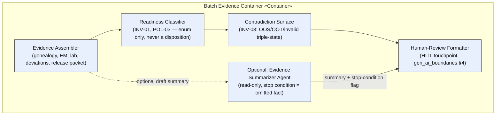

# C4 Level 3 — Components (Prompt 06)

**Artifact status: `provisional`.** Depth follows the skill's guidance ("deepen Code level only where risk warrants") — components are detailed for the Evidence-Resolver and Batch containers (highest invariant density); PV and Supply are described at the same pattern, not re-drawn in full.

*(Mermaid — renders natively in VS Code's built-in Markdown preview and on GitHub with no extension; see `.claude/skills/domain-and-architecture.md` "Diagram conventions" for the notation rules this follows.)*

## Diagram — Evidence-Resolver Service (shared kernel, highest reuse risk)

## Diagram — Batch Evidence Container (Workflow A, worked example)

## Component ↔ FR mapping

| Component | FR-ID (`09_REQUIREMENTS_TRACEABILITY.md` §2) | Container |
|---|---|---|
| Hash Engine | FR-06 | Evidence-Resolver |
| Contradiction Detector | FR-09 | Evidence-Resolver |
| Evidence Assembler | FR-01 | Batch |
| Readiness Classifier | FR-01, FR-02 | Batch |
| Contradiction Surface | FR-09 | Batch |
| Evidence Summarizer Agent | — (optional, no FR mandates it) | Batch |
| *(PV pattern, not redrawn)* Duplicate-Candidate Detector | FR-03, FR-04 | PV |
| *(Supply pattern, not redrawn)* Option Generator + Quality-Hold Filter | FR-05 | Supply |

## Trust / privacy / authority boundaries at component level

- **Readiness Classifier** and equivalent PV/Supply classifiers are the components INV-01/06 bind hardest to — the schema `const`/`enum` constraints (`evaluation/contracts/batch_response.schema.json`) are enforced here, not just documented.
- **Evidence Summarizer Agent** is the only component in this view with a Model Endpoint edge — every other component is deterministic code, directly implementing `04-ddd/gen_ai_boundaries.md` §1's "rules vs. AI" split.
