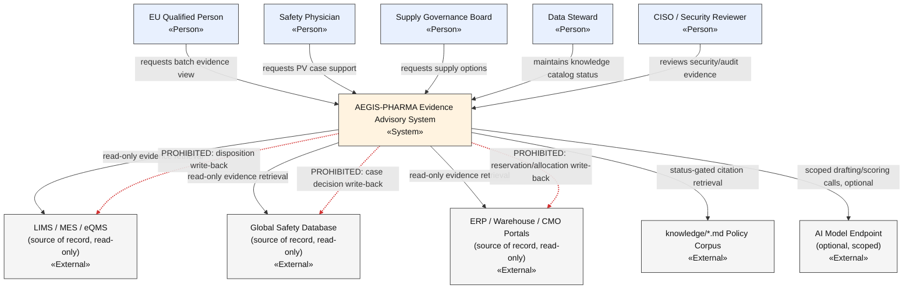

# C4 Level 1 — System Context (Prompt 06)

**Artifact status: `provisional`** (inherited from Prompt 04 `domain_model.md`; DDD SoT/language questions remain open — `04-ddd/domain_model.md` §8).

**Note on entry criteria**: Prompt 06 formally requires "Prompt 05 feature index." The AEGIS 30-artefact scheme has no dedicated Feature Specs template — its role is filled by artefact 09's functional-requirements table (`09_REQUIREMENTS_TRACEABILITY.md` §2, FR-01…FR-10), used here as the feature index.

## Diagram

*(Mermaid — renders natively in VS Code's built-in Markdown preview and on GitHub with no extension; see `.claude/skills/domain-and-architecture.md` "Diagram conventions" for the notation rules this follows.)*

## Notes

- **People**: the three accountable roles named in `04-ddd/context_map.md` (EU QP, Safety Physician, Supply Governance Board), plus Data Steward and CISO as operational/security participants (no decision authority).
- **External systems**: all read-only, per INV-01/06/07's prohibited-write invariants. The AI Model Endpoint is drawn as optional/scoped, reflecting `04-ddd/gen_ai_boundaries.md` §3 (agent freeze until architecture review passes).
- **PROHIBITED write paths are drawn explicitly** (red dashed, per `domain-and-architecture` skill convention) — the single most important fact this diagram must communicate: no arrow into a source system that isn't drawn PROHIBITED actually exists in the design.

## Mapping to bounded contexts

| System-context element | Bounded context (`04-ddd/`) |
|---|---|
| AEGIS-PHARMA system (as a whole) | All 7 contexts, composed |
| EU Qualified Person interaction | Batch Evidence & Release Readiness |
| Safety Physician interaction | PV Case Intake & Signal Support |
| Supply Governance Board interaction | Supply & Cold-Chain Option Planning |
| Data Steward interaction | Evidence & Provenance; Regulatory & Knowledge Authority |
| CISO interaction | Decision Authority & Accountability (audit view) |
