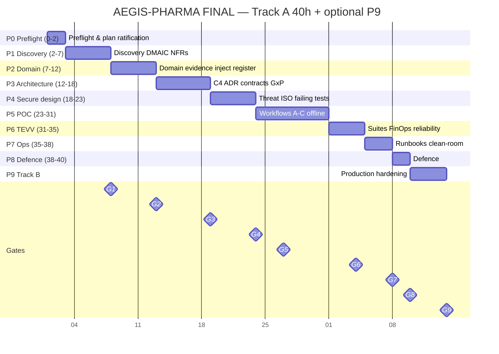

# Project AEGIS-PHARMA — Governing Project Plan (FINAL)

> **Supersedes** the four drafts in this folder: `AEGIS_PROJECT_MANAGEMENT_PLAN_V1.md`, `AEGIS_TIMELINE_AND_WORK_DIVISION_V2.pdf`, `AEGIS_PROJECT_PLAN_V3.md`, `AEGIS_PROJECT_PLAN_V4.md`. Prior drafts retained for audit. This file is the schedule and delivery SoT from ratification.

**Classification:** Synthetic training only — not for real GxP / clinical / PV / supply / recall decisions.

**Label key:** FACT = package-cited · INTERPRETATION = reasoned from facts · ASSUMPTION = unproven · DECISION = team choice · ABSTAIN = unresolved until evidence/as-of/auth present.

---

## Document control

| Field | Entry |
|---|---|
| Title | Governing Project Plan — dual-track capstone + optional production-ready RC |
| Owner | 5-person delivery team (seats P1–P5; fill names at kickoff) |
| Version / date | **FINAL v1.1** — 2026-08-04 |
| Status | Draft pending Stage 0 / G1 ratification |
| Principles addendum | Cursor eval architecture + 6-step eval workflow + engineering FinOps metrics (§11.8–§11.9) |
| Dual outcome | **(A)** Capstone defence-ready (G1–G8) · **(B)** Production-ready release candidate (requires G9) |
| Related | `MERGE_AUDIT.md`; `PROMPT_FINALIZE_PROJECT_PLAN.md`; package `WORKSHOP_DEPLOYMENT_PLAN.md`, `DEFINITION_OF_DONE.md` |
| Living location | `submission/artefacts/ProjectPlan/AEGIS_PROJECT_PLAN_FINAL.md` |
| Timeline PNG | `submission/artefacts/ProjectPlan/AEGIS_PROJECT_TIMELINE_FINAL.png` |
| 5-slide briefing | `submission/artefacts/ProjectPlan/AEGIS_PROJECT_PLAN_FINAL_5SLIDE.pptx` |
| Leadership 3-slide V2 | `submission/artefacts/ProjectPlan/AEGIS_PROJECT_PLAN_LEADERSHIP_V2_3SLIDE.pptx` |
| Day-wise FDE task matrix | `submission/artefacts/ProjectPlan/AEGIS_FDE_DAYWISE_TASK_DISTRIBUTION.md` |

---

## Non-negotiable constraints

1. **Writable boundary (FACT):** all work under `submission/`. Never edit challenge trees or `MANIFEST.md` / `FILE_HASHES.csv` to force a green package verifier.
2. **No prohibited autonomy (FACT):** no AI batch disposition, final PV decisions, clinical eligibility, reserve/allocate/ship, quality-status change, or recall initiation.
3. **Evidence fidelity (FACT):** preserve source, authority, effective date, version, time precision, unit, verbatim value, uncertainty; abstain when unresolved; never silent unit conversion or irreversible case merge.
4. **Tests before inference (FACT + DECISION):** prohibited-action / contract-negative tests exist and fail for the right reason before workflow implementation code.
5. **Offline / AI-disabled (FACT):** deterministic path + 14-day AI-disabled runbooks are Must.
6. **Label discipline (DECISION):** FACT / INTERPRETATION / ASSUMPTION / DECISION / ABSTAIN on material claims.
7. **Bytecode (FACT/DECISION):** every documented Python command uses `python -B` (or `PYTHONDONTWRITEBYTECODE=1`).
8. **Dual-track honesty (DECISION from V2):** score path = Track A (G1–G8 / 40h). “Production-ready” language requires Track B (P9 / G9, +16–24h). Never claim production-ready from Track A alone.
9. **Agent freeze (DECISION from V2):** agents / model-inference features OFF until **G4 PASS** and controls merged; deterministic core always on.

---

## 1. Purpose and scope

This plan governs **how the team executes the capstone**, not the detailed product design (artefacts 01–04). Scope: everything under `submission/`. Challenge evidence (`case/`, `data/`, `knowledge/`, `source_documents/`, `evaluation/`, `requirements/`, `starter/`, `templates/`) is immutable input.

### Mandatory workflows (FACT: `START_HERE.md`, contracts)

| ID | Workflow | Contract | Forbidden |
|---|---|---|---|
| A | GxP batch evidence reconciliation | `batch_response.schema.json` · `workflow=batch_evidence` | release / reject / reprocess / relabel / recall |
| B | PV intake & signal support | `pv_response.schema.json` · `workflow=pv_intake` | final seriousness / causality / expectedness / reportability / signal confirm |
| C | Supply / cold-chain options | `supply_response.schema.json` · `workflow=supply_options` | reserve / allocate / ship / quality-status change / recall; `no_side_effects` must be `true` |

All three require `execution_status: "not_executed"`, authorization checked at invocation, evidence with integrity hashes, contradictions/gaps/abstentions/human_review/audit.

### Production-ready language (from V2) — in / out of scope

**In scope (must ship for Track B claim):** three bounded fail-closed workflows; operable setup/run/test/evaluate/reset/export (offline); SLI/SLO, observability, incident/recovery, rollback, AI-disabled continuity; security/privacy/GxP hard gates traced to tests; TOM + support + go/no-go (26–28) + 90-day runway (29); clean-room install; Production Readiness checklist with **no Blocker** defects.

**Out of scope:** real patient / batch release / final PV / allocation / shipment / recall execution; claiming live MAH GxP validation or ISO 42001 certification.

**Product one-liner (DECISION):** Production-ready *decision-support* service for NTG training/demo estate — advisory only, human-accountable, offline-capable.

---

## 2. Merge provenance

| Draft | Absorbed into FINAL |
|---|---|
| V1.md (body “PMP V2”) | Validator policy, freeze/binary/bytecode, G-01…G-20, RAID/MoSCoW, clean-room 6 steps, 84/12/10/13 coverage, Mermaid, 200 ph model, entry criteria |
| V2.pdf (Timeline & Work Division) | Dual-track A/B, G1–G9, P9 hardening, Option B+ D1–D14, seats/streams, NFRs@G1, agent freeze, review pairs, owes G8/G9, kickoff, Readiness Board |
| V3.md (body v0.1) | FACT labels, problem/−14%/no-AI, stop triggers, evidence inventory, inject→contract maps, M0–M9, DoD checklist, next actions |
| V4.md (Combined Exec V2) | Realistic ~61h buffer, stakeholder pack RACI, hard-gate matrix, schema-exact build A→C→B, evidence-resolver, RELATIONSHIP_MODEL + knowledge_catalog gates, Cursor evidence, XSS note, innovation slot |

Prior gaps G-01…G-20 remain closed as in V1. New merge decisions: **G-21** role model = V2 seats (P4=GxP/ISO, P5=Sec/Eval); **G-22** gate SoT = G1–G9 with CP* mapping; **G-23** three budget labels (40h / realistic buffer / +P9). See `MERGE_AUDIT.md`.

---

## 3. Executive framing

### 3.1 Measurable problem hypothesis

| Item | Class | Statement | Evidence |
|---|---|---|---|
| Business pressure | FACT | Board requests **−14%** end-to-end release lead time without changing registered specs or Quality authority | `data/board_requests.csv` BR-01; INJ-001 |
| Fragmentation | FACT | LIMS/MES/EBR/QMS/RIM/EDC/safety/serialization/spreadsheets; inconsistent ID/time/terminology/access/authority | `case/INTEGRATED_CASE.md` §2; `SOURCE_SYSTEM_FACT_PACK.md` |
| Conflicting KPIs | FACT | Mfg / Quality / Safety / Clinical metrics conflict | `data/kpi_conflicts.csv`; INJ-002 |
| Intervention scope | DECISION | Narrow to three advisory workflows — not “AI for everything” | `START_HERE.md`; `ai_use_boundaries.csv` |
| Value claim | ASSUMPTION | Advisory reconciliation can cut search/rework/review burden without weakening accountability | Prove in Stage 1 via DMAIC + `cost_model.csv` / `staff_rates.csv` |

### 3.2 Affected decisions (human-accountable)

| Decision | Accountable (FACT) | AI authority | Source |
|---|---|---|---|
| Batch certification | EU Qualified Person | none | `decision_rights.csv` |
| ICSR reportability | Safety Physician | none | `decision_rights.csv` |
| Stock allocation | Supply Governance Board | draft only | `decision_rights.csv` |

### 3.3 No-AI alternative (challenge before architecture)

| Option (FACT) | Est. value % | Weeks | Source |
|---|---:|---:|---|
| master_data_repair | 38 | 10 | `no_ai_baselines.csv`; INJ-003 |
| rules_workflow | 27 | 6 | same |
| genai_assist | 51 | 14 | same |

**INTERPRETATION:** GenAI highest estimated value / longest duration → keep rules/master-data path as AI-disabled spine (`continuity_requirements.csv`; INJ-082).

**DECISION:** Do not commit LLM vs deterministic stack until Stage 1 compares no-AI options against INJ-006 / `ai_use_boundaries.csv`.

### 3.4 Stop / pivot / pause / abstain

| Trigger | Action | Basis |
|---|---|---|
| Design requires AI to release/reject batch, final PV, allocate/ship/recall, or change quality status | **STOP / PIVOT** | Hard gates; INJ-006 |
| Silent unit conversion or irreversible case merge | **STOP** | Hard gates; INJ-024 / INJ-037 |
| No offline deterministic / 14-day AI-disabled path | **PAUSE** | INJ-082 |
| Unresolved identity/unit/time/authority presented as resolved | **ABSTAIN** + gate fail | Package scope; EVALUATION_PLAN |
| Clean-room cannot reproduce | **STOP** defence readiness | DEFINITION_OF_DONE |
| “Production-ready” claimed without G9 | **STOP** language | V2 dual-track rule |

---

## 4. Toolchain constraints and verification policy

### 4.1 Environment baseline (FACT)

Python 3.10+ stdlib sufficient for supplied checks; no network/keys/DB required for package tools. Explorer = browser. Record interpreter version in decision log at Stage 0.

### 4.2 Which validator is authoritative (FACT — V1 G-01)

| Command | Status | When | Expected |
|---|---|---|---|
| `python -B run_capstone.py --check` / `tools/verify_package.py` | **Hour-0 baseline only** | Once before writing under `submission/` | PASS; archive `VALIDATION_REPORT.json` |
| `verify_package.py` after work begins | Expected FAIL (manifest exact-list) | Never as live gate | Do **not** edit `MANIFEST.md` |
| `tools/check_submission_structure.py --scaffold` | Live | Stages 1–7 | PASS |
| `tools/check_submission_structure.py --final` | Completion | G7/G8 and before defence | PASS |
| `tools/test_contracts.py` | Live | From contracts onward, every build | 3 positive valid; 3 negative invalid |
| `tools/hash_submission.py` | Freeze | Last before defence / RC | Writes hash set |
| `tools/hash_submission.py --check` | Verify | After freeze; clean-room; G9 RC | PASS |

**Integrity claim for defence:** challenge evidence unchanged (Hour-0 baseline + `FILE_HASHES.csv` for non-`submission/` paths) **plus** hashed submission set. Do **not** promise “whole-package verifier is green” after work exists.

### 4.3 Binary / freeze / bytecode

- Package verifier fails on NUL bytes → generated PDFs/PNGs are convenience copies; Markdown is primary.
- PDFs are **not** byte-reproducible → **freeze order:** (1) freeze Markdown/code → (2) export binaries if shipping → (3) `python -B tools/hash_submission.py` → (4) change nothing → (5) `--check`.
- Always `python -B` ( `__pycache__` is a hard verifier error).

---

## 5. Dual-track timeline, gates, calendars

### 5.1 Budgets (three labeled numbers)

| Budget | Hours | Meaning |
|---|---|---|
| Track A official (FACT) | **40** elapsed | Workshop contract stages 0–8 / G1–G8 |
| Track A realistic buffer (INTERPRETATION from V4) | **~55–70** | First-time team; Stage 2 + Stage 5 chronically underestimated |
| Track B P9 (from V2) | **+16–24** | Required only for production-ready claim / G9 |
| Person-hours Track A (from V1) | **200** gross (40×5); ~180 after ~20 governance overhead | Parallel five-person load |

**FACT:** Production-ready in 40h alone is impossible honestly — schedule P9 if that claim is required.

### 5.2 Gate register (SoT = G1–G9 from V2)

| Gate | Workshop hour (FACT) | V1 CP | Capstone (Track A) | Production-ready (Track B) |
|---|---:|---|---|---|
| Preflight | 0–2 | — | Package + charter | Same + prod intent |
| G1 | 7 | CP1 | Problem / no-AI / NFRs locked | Design/gov required |
| G2 | 12 | CP2 | Authority / identity / time / unit / lineage | Same |
| G3 | 18 | CP3 | Architecture / contracts / GxP | Prod topology |
| G4 | ~23 | — | Threat ∥ ISO / privacy; **agents may unlock after PASS** | Controls required |
| G5 | 26 | CP4 | Three-workflow MVP demo | Core deterministic features |
| G6 | 34 | CP5 | TEVV / red-team / cost | Pre-prod quality |
| G7 | 38 | CP6 | Clean-room + `--final` | Installability bar |
| G8 | 38–40 | — | Defence | May be conditional-go → P9 |
| G9 | after +16–24h | — | Optional for score | **Required** for prod-ready claim |

**Freeze:** do not reorder G1→G9. Agents OFF until G4 PASS.

### 5.3 Production NFRs — lock at G1 (from V2)

| NFR | Minimum bar |
|---|---|
| Availability | Degraded + AI-disabled modes; RTO/RPO targets |
| Integrity | Evidence hashing; audit trail; no silent unit conversion |
| Security | Zero Trust tools; signed manifests; stale-auth deny |
| Privacy | Purpose limitation; minimization; no real PHI in repo |
| Performance | Latency/cost budgets; denial-of-wallet caps |
| Support | L1/L2/L3 via TOM |
| Release | Versioned contracts; rollback; agents default OFF |
| Compliance | Intended use + exclusions; ISO 42001-**aligned evidence** (not certification claim) |

### 5.4 Option B+ calendar (recommended from V2) — ~4h sessions

| Day | Focus | Gate |
|---|---|---|
| D1 | Preflight + SCQA start | — |
| D2 | Business case, stakeholders, blueprint, prod NFRs | G1 |
| D3 | DDD + data gov + brownfield | — |
| D4 | Ontology + KG + inject map | G2 |
| D5 | C4 + ADR + contracts + GxP | G3 |
| D6 | Threat modelling + privacy + security tests | — |
| D7 | ISO 42001 + EU AI Act + assurance + human factors | G4 |
| D8 | Build Workflows A (+ shared resolver) + app shell; start C path | — |
| D9 | Finish C + B; AI-disabled; MVP demo | G5 |
| D10 | TEVV / eval reports / FinOps (product+delivery); clean-room; defence | G6–G8 |
| D11 | P9: SLO, runbooks, packaging | — |
| D12 | P9: security retest, backup/restore, rollback | — |
| D13 | Production Readiness Board + RC tag | G9 |
| D14 | Buffer / defect burn-down (optional) | — |

**Compressed Option A (from V4):** Day1 stages 0–2; Day2 stages 3–4; Day3 stage 5; Day4 stages 6–8 — then optional P9 days.

**Engineering dependency vs calendar (DECISION G-24):** Shared evidence-resolver and Workflow **A first**, then **C**, then **B** (schema/reuse). Calendar may pair A+B on D8 only if shared modules are already merged; otherwise slip B to D9 after C.

---

## 6. Team, RACI, capacity

### 6.1 Seats (fill names at kickoff — freeze after)

| Seat | Role | Backup | One-line ownership |
|---|---|---|---|
| P1 | Product / Value Lead | P2 | Why / who / worth it / pitch / supply options / ship decision |
| P2 | Domain / Evidence Lead | P4 | What evidence means / DDD / PV intake truth |
| P3 | Architecture / Build Lead | P5 | How it’s built / app / contracts / RC packaging |
| P4 | GxP / Quality / ISO / Assurance Lead | P1 | What’s allowed in GxP / ISO-aligned gov / batch readiness / G9 board |
| P5 | Security / Privacy / Eval / Reliability Lead | P3 | What can go wrong / tests / threat / cost / uptime |

Aliases: P1…P5 ≡ FDE-1…5 from older drafts.

**Author ≠ sole approver.** P4 + P5 may veto go-live / defence on hard-gate failure.

### 6.2 Review rules

| If the work is… | Primary | Must review |
|---|---|---|
| Problem, value, pitch, roadmap, Workflow C | P1 | P4 or P5 |
| Evidence, DDD, data, ontology, Workflow B | P2 | P3 or P4 |
| Code, C4, ADR, contracts, app, scripts | P3 | P5 + P4 (if GxP claim) |
| GxP, QRM, ISO 42001, assurance, Workflow A | P4 | P5 or P1 |
| Threat, privacy, TEVV, FinOps, observability | P5 | P4 or P3 |

### 6.3 Stakeholder grounding (FACT: `STAKEHOLDER_PACK.md`)

| Real stakeholder | Maps to seat / workflow boundary |
|---|---|
| Chief Quality Officer / EU QP | P4 — Workflow A prohibited-action boundary |
| Global Head of Pharmacovigilance | P2 + P4 dual — Workflow B boundary |
| Supply Chain VP | P1 — Workflow C boundary |
| Manufacturing VP | Reinforces A: operations ≠ independent release |
| DPO / CISO | P5 — privacy / threat |
| Head of Biostatistics | P3 — no adaptive undeclared transforms |
| Patient Safety Representative | Adversarial pre-defence roleplay |

**Five declared conflicts — owners:** Quality vs Mfg → P4 (02, 15); Global vs local → P1 (26); Privacy vs GxP retention → P5 (17; INJ-035); Bundled vendor vs substitutability → P3+P5 (11, 27); ClinOps automation vs Biostats → P3 (build constraints).

### 6.4 Workflow RACI

| Workflow | Domain | Builder | Security | Sign-off |
|---|---|---|---|---|
| A Batch evidence | P4 | P3 | P5 | P4 |
| B PV intake | P2 | P3 | P5 | **P2 + P4** |
| C Supply options | P1 | P3 | P5 | **P1 + P4** |
| Shared authZ / contracts / evidence-resolver | — | P3 | P5 | P5 + P4 |

### 6.5 Parallel streams

- **V (P1):** value → blueprint → supply → TOM/pitch → release  
- **D (P2):** DDD/data/ontology → PV domain → evidence register  
- **A (P3):** C4/ADR/contracts → src/app/scripts → RC  
- **Q (P4):** GxP/QRM → ISO-aligned gov → batch → G9 board  
- **S (P5):** threat/privacy → TEVV/FinOps → observability → sec sign  

### 6.6 Delivery-cost note

Log team AI/tool spend per stage in the decision log — cheapest evidence for artefact 23 discipline. Track the eight **engineering FinOps** metrics in §11.9 daily (`finops_delivery_log.csv`); do not rely on product TCO alone.

---

## 7. Deliverable inventory and structural gate

### 7.1 “Substantive” (FACT: `check_submission_structure.py`)

≥120 non-whitespace chars; not `.gitkeep`/`README.md`; if under 500 chars, no TODO/TBD/PLACEHOLDER/INSERT HERE/NOT STARTED. Binaries count if >200 bytes. **PDFs inflate artefact counts** — plan to 30 *real* artefacts, not counter gaming.

### 7.2 Minima for `--final`

| Directory | Min | Planned | Owner | Phase |
|---|---:|---|---|---|
| `artefacts/` | 30 | 30 templates + this plan | All (§12) | P1–P8 |
| `src/` | 2 | WF A/B/C + evidence-resolver | P3 (+domain) | P5 |
| `tests/` | 5 | Golden/edge/adversarial/subgroup/outage/prohibited | P5 (+P3/P4) | P4–P6 |
| `evaluation/` | 3 | Offline eval framework: `datasets/`, `adapters/`, `graders/`, `policies/`, `reports/`, `runner.py`, `README.md` + mirrored inject tracker (§11.8) | P5 | P3–P6 |
| `evidence/` | 4 | **submission_manifest.csv**, **file_hashes.csv**, **test_results.json**, **evaluation_results.json** | P3/P5 | P7 |
| `runbooks/` | 4 | SETUP, OPERATIONS, INCIDENT, AI_DISABLED | P5+P1 | P5–P7 |
| `scripts/` | 5 | setup, run, test, evaluate, reset (+ export) | P3 | P1 skeleton → P7 |
| `app/` | 1 | Demonstrator (safe DOM — no `innerHTML`) | P3 | P5 |

`submission_manifest.csv` columns exactly: `path,owner,version,status,sha256`.

---

## 8. Work breakdown — phases + P9

Hours = official Track A unless noted. Entry criteria must hold before start.

| Phase | Off. h | Realistic h | ph | Entry | Parallel focus | Exit / Gate |
|---|---:|---:|---:|---|---|---|
| P0 Preflight | 2 | 3 | 10 | Repo writable; Py 3.10+ | All: baseline PASS archived; read scope+case; ratify this plan; `-B` convention | Preflight report, charter → Preflight |
| P1 Discovery | 5 | 7 | 25 | P0 done | P1: 01–04 + NFRs; P2 inject skim; P3 script skeleton; P4/P5 constraints catalogue | 01–04; G1 |
| P2 Domain | 5 | 9 | 25 | G1 | P2: 05–08 + 84-inject register; P3 RTM/language; P4 authority; RELATIONSHIP_MODEL checker + knowledge_catalog gate started | 05–09; evidence map; G2 |
| P3 Architecture | 6 | 8 | 30 | G2 | P3: 10–12 + shared evidence-resolver; P4: 13–15; P5 threat skeleton; contract tests green | 10–15; G3 |
| P4 Secure design | 5 | 6 | 25 | G3 | P5: 16–17 + failing prohibited tests; P4: 19–21; P1: 18; Cursor evidence | 16–21; **G4** (agents may unlock) |
| P5 POC build | 8 | 14 | 40 | G4; failing tests exist | P3 build A→C→B + app; domain rules; P5 tests; AI-disabled scripts | 3 workflows offline; G5 |
| P6 TEVV | 4 | 6 | 20 | G5 | P5: runner+graders+policies+reports (§11.8); 12 suites + 22–25; P1 FinOps 23 + delivery FinOps §11.9; red-team/outage | Report set + machine-readable results; G6 |
| P7 Ops + clean-room | 3 | 4 | 15 | G6 | P1: 26,29; P4: 27+28 draft; runbooks; evidence files; clean-room | G7 |
| P8 Defence | 2 | 4 | 10 | G7; `--final` + freeze | Pitch 30; 13 defence elements; recommendation | G8 |
| **P9 Hardening** | **16–24** | same | — | G8 (or conditional-go) | See §8.1 | **G9** |

### 8.1 P9 production hardening (Track B)

| Workstream | Owner | Hours | Done when |
|---|---|---:|---|
| App packaging & config | P3 | 3 | Versioned RC; locked deps |
| Observability & SLOs | P5+P3 | 3 | Metrics/logs; error budget |
| Security harden + retest | P5 | 3 | Threat controls on RC |
| Backup/restore + rollback | P3+P5 | 2 | RTO/RPO evidence |
| Support runbooks | P1+P5 | 2 | Ops, incident, AI-disabled, kill switch |
| Performance/budget soak | P5 | 2 | Within declared budgets |
| Accessibility smoke | P4+P1 | 1 | Keyboard/critical-path |
| Production Readiness Board | All | 2 | Artefact 28; Blockers=0 |
| RC tag + manifest | P3 | 1 | Immutable evidence bundle |

**G9 Go only if:** G1–G8 PASS; artefact 28 complete; no Blockers; hard gates hold on RC; clean-room on RC PASS; P4 residual risk + P5 security + P1 release decision signed.

### 8.2 Checkpoint questions (independent reviewers)

| Gate | Question | Reviewers |
|---|---|---|
| G1 | Problem measurable; no-AI honest; NFRs locked? | P4 + P5 |
| G2 | Conflicts tracked not silently resolved; inject register real? | P1 + P4 |
| G3 | Prohibited actions outside executable boundary? | P2 + P5 |
| G4 | Threat/privacy/ISO-aligned controls + failing prohibited tests exist? | P1 + P3 |
| G5 | Three workflows run offline against fixtures? | P1 + P4 |
| G6 | Red-team / outage / cost gates fail closed as designed? | P2 + P3 |
| G7 | Clean-room + `--final` + hash `--check`? | Full team; one outsider |
| G8 | 13 defence elements rehearsed; recommendation clear? | Full team |
| G9 | Readiness Board; Blockers=0; RC clean-room? | P4 chairs |

Failed gate: 1 hour remediation → retry or MoSCoW cut (§16). No silent slip.

### 8.3 Critical path

Track A: P0→…→P8 fully sequential at phase level — **no float**. Riskiest: P3→P4→P5 and P6→P7→P8 freeze. Track B: P9 after G8; G9 Board is terminal.

---

## 9. Timeline (Mermaid — Track A)

**PNG chart (SoT visual):** `submission/artefacts/ProjectPlan/AEGIS_PROJECT_TIMELINE_FINAL.png` — dual-track Gantt (Track A 40h + Track B P9 mid-20h of 16–24h range) with gates G1–G9.

Calendar dates are a scale device (1 day ≈ 1 elapsed hour from arbitrary epoch). Read hour labels, not axis dates.

| Phase | Start h | End h | Dur | ph | Gate |
|---|---:|---:|---:|---:|---|
| P0 | 0 | 2 | 2 | 10 | Preflight |
| P1 | 2 | 7 | 5 | 25 | G1 |
| P2 | 7 | 12 | 5 | 25 | G2 |
| P3 | 12 | 18 | 6 | 30 | G3 |
| P4 | 18 | 23 | 5 | 25 | G4 |
| P5 | 23 | 31 | 8 | 40 | G5 @26 |
| P6 | 31 | 35 | 4 | 20 | G6 @34 |
| P7 | 35 | 38 | 3 | 15 | G7 @38 |
| P8 | 38 | 40 | 2 | 10 | G8 |
| **Track A total** | | | **40** | **200** | |
| P9 | after G8 | +16–24 | 16–24 | — | G9 |

---

## 10. Dependencies

| Dependency | Type | Risk if late/wrong |
|---|---|---|
| Immutable case/data/knowledge | Fixed input | None — fully disclosed Hour 0 |
| Hour-0 integrity baseline | One-shot | **Cannot recreate** after work starts |
| Brownfield starter anti-patterns | Fixed | Team may extend defects instead of replacing |
| Executable contracts + samples | Fixed | Outputs won’t validate |
| Public fixtures PUB-01…15 | Fixed | Eval not reproducible |
| G4 controls + failing tests | Sequential | Guardrails retrofitted under pressure |
| Eval thresholds pre-committed | Sequential | Post-hoc thresholds disallowed by EVALUATION_PLAN |
| Content freeze before hash | Terminal | Silently invalidates `file_hashes.csv` |
| G9 on G1–G8 + RC clean-room | Track B | False production-ready claim |

---

## 11. Coverage obligations

### 11.1 Eighty-four inject test obligations (FACT: `INJECT_TEST_COVERAGE.csv`)

Mirror under `submission/evaluation/` — **do not edit** challenge CSV. All start `NOT_RUN`.

| Test class | n | Dim | Owner phase | Owner |
|---|---:|---|---|---|
| business_value_and_no_ai | 6 | D01 | P1 | P1 |
| data_model_and_research_boundary | 6 | D02 | P2 | P2 |
| clinical_integrity_and_abstention | 8 | D03 | P6 | P2/P5 |
| gxp_evidence_and_prohibited_disposition | 8 | D04 | P5 | P3/P4 |
| data_integrity_and_validation | 8 | D05 | P3/P5 | P4 |
| pv_boundary_and_source_fidelity | 8 | D06 | P5 | P5/P2 |
| regulatory_authority_and_completeness | 6 | D07 | P6 | P4 |
| supply_constraint_and_no_side_effect | 8 | D08 | P5 | P3/P1 |
| privacy_purpose_and_cross_border | 6 | D09 | P4/P6 | P5/P2 |
| security_zero_trust_and_agent_abuse | 6 | D10 | P4/P6 | P5 |
| human_factors_subgroup_and_accessibility | 4 | D11 | P6 | P1/P2 |
| token_cost_and_vendor_economics | 4 | D12 | P6 | P1/P5 |
| outage_recovery_exit_and_retirement | 6 | D13 | P6/P7 | P3/P4 |

### 11.2 Workflow evidence maps (summary)

**A — Batch:** INJ-021…028 (+ D05 support); datasets batches, genealogy, warehouse, EM, micro, lab, OOS, interfaces, ebr, cleaning, PAT/recipes, release_packets, supplier_audits, deviations/capa, … · Fixtures PUB-01…03 · Knowledge verify via catalog before use.

**B — PV:** INJ-037…044; icsr, duplicates, receipts, adverse_events, terminology, listedness, labels, sensitive_segments, social, complaints, signals · PUB-04…06 · Treat `FAKE_PV_EXPEDITED_RULE.md` as poison candidate.

**C — Supply:** INJ-051…058; shipments, loggers, serialisation, inventory, demand, allocation_constraints, CMO, suppliers, recall_candidates · PUB-07…08.

### 11.3 Schema-exact outputs (FACT: contracts)

**Shared every response:** `request_id, workflow, as_of, authorization{user,purpose,checked_at,decision}, evidence[], contradictions, gaps, abstentions, human_review, execution_status="not_executed", audit` · `additionalProperties: false`.

**evidence_item:** `source, record_id, authority, effective_at (string|null), retrieved_at, facts, integrity{sha256: 64 hex, source_preserved: true}`.

**Batch adds:** `batch_id, readiness_state ∈ {insufficient_evidence, conflicted_evidence, ready_for_authorized_review}, applicable_documents`.

**PV adds:** `case_ids (≥1), source_facts, duplicate_candidates, clock_evidence, terminology, listedness_context, required_reviews`.

**Supply adds:** `event_id, options[] (each status const "draft"), constraints, approvals_required, quality_holds, no_side_effects: true`.

**Shared module (DECISION):** Stage P3 evidence-resolver computes real SHA-256, stamps `source_preserved`, runs `knowledge_catalog` authority+hash check, and `RELATIONSHIP_MODEL` FK validation — reused by A/B/C.

### 11.4 Twelve evaluation suites (FACT)

1 Business baseline · 2 Evidence fidelity/provenance · 3 GxP/safety prohibited · 4 Data integrity/e-records · 5 Retrieval authority/poisoning/injection · 6 Structured output/abstention/human review · 7 PV duplicate/clock/terminology/listedness/multilingual · 8 Agent path/authz/idempotency/replay · 9 Privacy/cross-border/purpose · 10 Subgroup/language/a11y · 11 Latency/token/cost/DoW · 12 Model sub/outage/rollback/manual/retirement.

Runner records: scenario ID, input hash, impl version, contract version, result, evidence path, reviewer role, gate outcome. Thresholds justified **before** results.

### 11.5 Ten release gates (FACT) — each needs a blocking demo

Schema failure; fabricated/uncited fact; unresolved ID/unit/time/authority presented as resolved; stale authorization; untrusted instructions; prohibited conclusion/side effect; missing manual mode; failed critical security test; missing subgroup evidence; unreproducible build/eval.

### 11.6 Thirteen defence elements (FACT: `FINAL_DEFENCE.md`)

1 Pitch+exec case · 2 Baseline/no-AI/value · 3 Live 3 workflows · 4 Prohibited-action test · 5 Malicious doc + poisoned tool · 6 Unit/term/temporal/identity conflicts · 7 Outage/fallback/AI-disabled · 8 Eval+subgroup+failed gates · 9 Token/TCO incl. human review · 10 Arch/DDD/ontology/KG/ADR · 11 Inspection evidence request · 12 Vendor exit/substitution/retirement · 13 Board recommendation (go/conditional/pivot/pause/stop). Assign named presenters at P8.

### 11.7 Public fixtures

PUB-01…03 batch · 04…06 pv · 07…08 supply · 09 security · 10 reliability · 11 privacy · 12 integration · 13 agent · 14 finops · 15 clinical — all `expected_answer_included=no`.

### 11.8 Cursor evaluation architecture (mandatory shape)

Reusable offline-first eval framework under **`submission/evaluation/`** (package path; do not put solution evals in immutable `evaluation/` challenge tree).

| Component | Role | Owner | When |
|---|---|---|---|
| **Brownfield system under test** | Challenge `starter/` + later `submission/src` workflows | FDE-3 | D1 baseline → D8–D9 improved |
| **Datasets** | `submission/evaluation/datasets/` — questions & hard situations: normal, edge, adversarial, metamorphic, outage; required/prohibited behaviours; hard-gate flags | FDE-5 (+FDE-2 domain) | Design D3–D6; freeze thresholds before results |
| **Adapter** | `submission/evaluation/adapters/` — connector capturing input, final output, evidence used, tools called, retries, errors, approvals, side effects, latency | FDE-3 | D8 (wire to WF A/B/C) |
| **Runner** | `submission/evaluation/runner.py` — executes suites; records scenario ID, input hash, impl/contract versions, result, evidence path, reviewer, gate outcome | FDE-5 | D5 stub → D10 full |
| **Graders** | `submission/evaluation/graders/` — deterministic checks: schema, required facts, evidence, prohibited actions, authority, security, temporal/unit, trajectory, latency; **positive + negative unit tests per grader** | FDE-5 | D6–D9 |
| **Policies** | `submission/evaluation/policies/` — automatic failure / release-gate rules (FINAL §11.5 ten gates + hard gates) | FDE-4 + FDE-5 | D5–D7 design; D10 enforce |
| **Reports** | `submission/evaluation/reports/` — `summary.json`, `detailed_results.jsonl`, `scorecard.csv`, `failed_cases.json`, `final_evaluation_report.md` plus package `test_results.json` / `evaluation_results.json` | FDE-5 | D10 (+ brownfield baseline report earlier) |

**Six-step Cursor eval workflow → plan mapping**

| Step | Goal | Plan home |
|---|---|---|
| 1 Understand repository | Workflows, I/O, evidence, tools, rules, tests, failure handling, human approval | P0–P2 / D1–D4 |
| 2 Design eval set | Normal/edge/adversarial/metamorphic/outage; required & prohibited; escalation; hard-gate status | P2–P4 / D3–D7 |
| 3 Create structure | `datasets/ adapters/ graders/ policies/ reports/ runner.py README.md` | P3–P4 / D5–D6 |
| 4 Build adapter | Connect runner to workflows; capture trajectory metrics | P5 / D8–D9 |
| 5 Create graders | Deterministic graders + ± unit tests | P4–P5 / D6–D9 |
| 6 Run & capture baseline | Full suite on **unmodified brownfield** (`starter/`) then regression on `submission/src`; emit report set | P0 clue + **explicit baseline run by D5/D8**; improved suite D10 / G6 |

Goal of the framework: **measure current state, identify gaps, create a foundation for improvement** — not to fabricate answer keys (`expected_answer_included=no`).

### 11.9 Engineering FinOps metrics (delivery efficiency)

Artefact **23** covers product token/TCO. Separately, the team logs **Cursor delivery FinOps** in `submission/evidence/finops_delivery_log.csv` (or equivalent) per working day / major task:

| # | Metric | Why track | Owner |
|---|---|---|---|
| 1 | Chat sessions used | Fragmented / repeated work | FDE-1 |
| 2 | Files attached | Context scope | Each task owner |
| 3 | Agent iterations | Rework signal | Each task owner |
| 4 | Terminal commands | Exploration overhead | FDE-3 |
| 5 | Files modified | Over-broad changes | FDE-3 |
| 6 | Failed attempts | Wasted effort | Task owner |
| 7 | Full-suite runs | Unnecessary validation cost | FDE-5 |
| 8 | Task outcome | Usage → value (PASS/FAIL/CONDITIONAL) | Reviewer |

**Formula:** usage metrics + efficiency signals + outcome tracking → better FinOps decisions (feeds artefact 23 and defence element 9). Avoided inference and offline deterministic path remain first-class cost controls.

---

## 12. Artefact assignment matrix

Hard-gate column verified against `requirements/ASSESSMENT_RUBRIC.csv` (`hard_gate_related=Yes` → RUB-05,08,09,10,11,13,15).

| # | Template | Phase | A/R | Reviewer | Rubric | Hard gate? |
|---|---|---|---|---|---|---|
| 01–04 | Business/DMAIC/Stakeholder/Blueprint | P1 | P1 | P4/P5 | RUB-01…03 | No |
| 05–08 | DDD/DataGov/Ontology/KG | P2 | P2 | P3/P4 | RUB-04,05*,06 | **06 Yes** |
| 09 | Requirements RTM | P2–P3 | P2/P3 | P3/P5 | RUB-05,07 | **Yes** |
| 10–12 | C4/ADR/Integrations | P3 | P3 | P4/P5 | RUB-04,05*,07 | **12 Yes** |
| 13–15 | GxP/CSA/QRM | P3 | P4 | P5/P1 | RUB-09 | **Yes** |
| 16–18 | Threat/Privacy/RAI | P4 | P5 | P4/P1 | RUB-10,11 | **Yes** |
| 19–21 | EU AI Act/ISO/Assurance | P4 | P4 | P5/P1 | RUB-12 | No |
| 22–25 | Eval/FinOps/Reliability/Incident | P6 | P5 | P4/P3 | RUB-13,14,15 | **22,24,25 Yes** |
| 26,29,30 | TOM/Roadmap/Pitch | P7–P8 | P1 | P4/P5 | RUB-16,17 | No |
| 27 | Vendor exit | P7 | P5 | P4/P3 | RUB-15 | **Yes** |
| 28 | Production readiness | P7/P9 | P4 chairs · P3 tech · P5 sec | Board | RUB-16 | No (but G9 gate) |
| Code | `src`/`tests`/`app` | P5 | P3 build · P5 tests | P5+P4 | **RUB-08 (18pts)** | **Yes** |

\*RUB-05 also covers 06/09/12.

**If time short:** protect hard-gate set 06,09,12,13–18,22,24,25,27 + code. Cut depth on 08,19,20,23,26,28,29 before cutting workflows.

**App components:** `src` P3 (+domain); `app` P3 (+P1 UX); `tests` P5; `scripts` P3; `runbooks` P5+P1; `evidence` P3 manifest / all contribute.

---

## 13. Three-workflow build plan

1. **P3:** evidence-resolver (hash + catalog authority + RELATIONSHIP_MODEL) + contract validators.  
2. **Workflow A** — load D04/D05 CSVs; contradictions for INJ-021…024,028; readiness_state only; no disposition fields.  
3. **Workflow C** — reuse resolver; options all `draft`; `no_side_effects: true` on all paths including errors; INJ-051,054–056.  
4. **Workflow B** — hardest; preserve verbatim source_facts; distinct clock_evidence; both MedDRA versions; listedness_context; required_reviews for sensitive segments; never emit final safety conclusions.  
5. Authz at execution (INJ-067); unsigned/poisoned tools denied (INJ-065/066); idempotent `request_id`; offline mode; `submission/app` uses text nodes — **no `innerHTML`** (AUDIT XSS lesson).  
6. Continuous `python -B tools/test_contracts.py`.

---

## 14. Engineering milestones

| ID | Milestone | Gate | Done when |
|---|---|---|---|
| M0 | Scaffold + charter + this plan ratified | Preflight | `--scaffold` PASS |
| M1 | Problem + no-AI + NFRs | G1 | 01–04 drafted |
| M2 | Evidence authority map; conflicts listed | G2 | Inject register real |
| M3 | Contracts + resolver + `test_contracts` | G3 | ± samples behave |
| M4 | Threat + failing prohibited tests | G4 | INJ-065/066/067 specs fail first |
| M5 | Three workflows offline deterministic | G5 | Hour-26 demo |
| M6 | PUB-01…15 + suites 1–12 via adapter→runner→graders→policies | G6 | Report set (§11.8) + JSON results |
| M6b | Brownfield baseline eval on unmodified `starter/` | ≤D8 | Baseline reports under `evaluation/reports/baseline/` |
| M7 | AI-disabled continuity drill | G5–G7 | Runbook evidence |
| M8 | Manifest + hashes + `--final` | G7 | Structural PASS |
| M9 | Defence recommendation | G8 | go/conditional/pivot/pause/stop |
| M10 | RC + Readiness Board | G9 | Track B only |

---

## 15. Engineering tooling and process assets

| Asset | Use at |
|---|---|
| `.cursor/rules/pharma-fde.mdc` | Always-on guardrails |
| Commands 00 qualify / 01 map evidence / 02 tests-first | P1 / P2 / P3–P4 |
| Skills gxp / pv / supply | Workflows A/B/C |
| Agents security / test / evidence reviewers | Cross-checks; save outputs under `submission/evidence/` |
| `prompts/PROMPT_LIBRARY.md` (6 prompts) | Stages as mapped in V4 |
| Cursor 6-step eval workflow (§11.8) | Understand → design set → structure → adapter → graders → baseline/regression reports |

Cite skill/command used in ADRs (11). If not using Cursor, load equivalent guardrail text and record the tool.

---

## 16. RAID and MoSCoW

| ID | Type | Description | Owner | Trigger |
|---|---|---|---|---|
| R-001 | Risk | 200 ph << full production quality for 30 artefacts + 3 WF + 12 suites + 84 TC | P1 | Every gate |
| R-002 | Risk | “Cleaning” deliberate ambiguity | P2 | G2 |
| R-003 | Risk | Write/execute path appears in integrations | P3 | G3, every P5 review |
| R-004 | Risk | Malicious SOP / poisoned tool trusted | P5 | Before tool-calling code |
| R-005 | Risk | Promise package verifier green at defence | P4 | G7 rehearsal |
| R-006 | Risk | Freeze order violated | P5 | P8/P9 |
| R-007 | Risk | Thresholds set after seeing results | P5 | Commit at P4 |
| R-008 | Risk | Want prod-ready inside 40h | P1 | Kickoff — schedule P9 or drop claim |
| R-009 | Risk | Build overrun | P3 | Ship deterministic RC; agents OFF |
| R-010 | Risk | G9 Blockers | P4 | No-Go; fix before prod language |
| A-001 | Assumption | Equivalent evidence OK for few templates if mapped in manifest | P1 | Hour 31 |
| A-002 | Assumption | Jurisdiction/purpose/role stated once per WF | P4 | — |
| A-003 | Decision | Seat model = V2 (P4 GxP, P5 Sec/Eval) | Team | Kickoff |
| A-004 | Decision | PDF convenience copies optional; Markdown primary | P3 | By P7 |

### MoSCoW

- **Must (never cut):** 3 offline workflows; prohibited-action fail-closed tests; 4 evidence files; 4 runbooks; 5 scripts; `--final`; defence elements 3,4,5,7,13; agent freeze until G4; dual-track honesty.
- **Should:** full 12-suite depth (never drop suites 3,4,5,9,12); ≥10 ADRs; subgroup breadth; Track B if claim needed.
- **Could:** PDF exports; UI polish; Cursor evidence beyond rules; deep 19/20 where applicability argued.
- **Won’t:** real regulated use; editing challenge evidence; editing MANIFEST/FILE_HASHES to force green; claiming ISO/GxP certification.

---

## 17. Governance and change control

- **Daily:** 15-min standup (yesterday / today / gate risk).
- **Decision log:** assumptions same day; no undocumented oral decisions.
- **Plan changes:** new RAID row + version bump — not silent edit.
- **ADRs:** reviewed by P1+P4 before merge when they affect intended use/boundaries.
- **Escalation:** gate failure >1h → full team MoSCoW decision → manifest gap.

### Owes

| Member | By G8 (defence) | Extra by G9 |
|---|---|---|
| P1 | 01–04, 26, 29, 30; WF C | Release decision; L1 runbook; G9 minutes |
| P2 | 05–08; inject map; WF B | RC domain regression sign-off |
| P3 | 09–12; app/src/scripts; clean-room | RC tag, packaging, rollback, manifest |
| P4 | 13–15, 19–21; WF A; GxP proof | Chair 28 board; residual risk sign |
| P5 | 16–18, 22–25, 27; security tests | SLO/observability; RC retest; G9 sec sign |

### Kickoff checklist

1. Write real names into seat table.  
2. Copy templates 01–30 → `submission/artefacts/`.  
3. P3 scaffolds `src|app|tests|scripts|runbooks|evidence`.  
4. P1 opens Assumptions / Decision / RAID logs under `submission/evidence/`.  
5. Book calendar for gates G1–G9.  
6. Confirm: **no agent feature coding before G4**.  
7. Archive Hour-0 `VALIDATION_REPORT.json`.  
8. Ratify this FINAL plan.

---

## 18. Clean-room procedure (G7; repeat on RC for G9)

Per `runbooks/REPO_EXECUTION.md`, outsider member:

1. Extract package to a **different directory**.  
2. Run preflight **twice** (detect generated-file drift).  
3. Run documented setup/run/test/evaluate/reset with `python -B`.  
4. `python -B tools/hash_submission.py --check`.  
5. `python -B tools/check_submission_structure.py --final`.  
6. Document platform limits; never “fix” by editing immutable hashes.

---

## 19. Exit criteria and DoD

### Track A (before/at G8)

- [ ] `check_submission_structure.py --final` PASS  
- [ ] `test_contracts.py` PASS  
- [ ] `hash_submission.py --check` PASS after freeze  
- [ ] Hour-0 baseline archived; `FILE_HASHES.csv` OK for non-submission paths  
- [ ] Every hard gate has evidenced “cannot occur” test  
- [ ] 84 TC mirrored results ≠ `NOT_RUN` or declared gap  
- [ ] 13 defence elements have presenters  
- [ ] Manifest complete including equivalent-evidence / cuts  

### Track B (G9)

- [ ] All Track A + artefact 28 complete · Blockers=0 · hard gates on RC · clean-room on RC · signed release  

### DoD mirror (`DEFINITION_OF_DONE.md`)

| # | Criterion | Status |
|---|---|---|
| 1 | Problem, baseline, decisions, users, constraints, no-AI | PENDING |
| 2a–c | Three workflows advisory-only as specified | PENDING |
| 3 | Reproducible commands; RTM; brownfield migration | PENDING |
| 4 | GxP/security/privacy; fail-closed; authz-now | PENDING |
| 5 | Suites; SLOs; FinOps; continuity | PENDING |
| 6 | 30 artefacts; manifest; hashes; `--final` | PENDING |
| 7 | Defence demos + recommendation | PENDING |

---

## 20. Innovation slot (bounded)

Pick after G2: (a) cross-workflow signal correlation, or (b) frame RELATIONSHIP_MODEL + knowledge_catalog resolver as entity-resolution moonshot in artefacts 08/30. Demo in P6 — not before G4. Must remain advisory; test against Biostatistics roleplay.

---

## 21. Immediate next actions

1. Fill seat names; ratify this plan at P0.  
2. Archive Hour-0 verifier PASS.  
3. Create `team_charter.md` + assumptions/decision/RAID logs.  
4. `python -B tools/check_submission_structure.py --scaffold`.  
5. Start artefact 01 from BR-01 / kpi_conflicts / no_ai_baselines / INJ-001…006 — cite paths; no conflict cleaning.  
6. Book G1 (hour 7) review.  
7. Lock production NFRs table into decision log (even if Track B deferred).

---

## 22. Traceability (plan claims)

| Claim | Control | Test / eval | Evidence path | Result |
|---|---|---|---|---|
| SoD survives 5-person compression | §6 seats/reviews | Gate pairing | This plan | Pending |
| Integrity claim defensible | §4.2 | Hour-0 + FILE_HASHES + submission hashes | `submission/evidence/` | Pending |
| Byte-reproducible submission | §4.3 freeze | `hash_submission.py --check` | `submission/evidence/` | Pending |
| No prohibited executable path | §§11–13; G4 before P5 | `test_contracts` + prohibited suite | `submission/tests/` | Pending |
| 84 inject obligations addressed | §11.1 mirror | Gate outcomes | `submission/evaluation/` | Pending |
| Eval stack + baseline reports | §11.8 | Adapter/runner/graders/policies/reports | `submission/evaluation/` | Pending |
| Engineering FinOps metrics | §11.9 | Eight metrics logged | `submission/evidence/finops_delivery_log.csv` | Pending |
| Release gates block | §11.5 | Failed-gate demos | `submission/evaluation/` | Pending |
| Dual-track honesty | §§5, 8.1 | G9 absent ⇒ no prod-ready language | Defence script | Pending |
| Clean-room | §18 | G7 (+G9 RC) | `submission/evidence/` | Pending |

---

## 23. Review record

| Reviewer | Finding | Resolution | Date |
|---|---|---|---|
| Finalize prompt execution | Four drafts merged per PROMPT_FINALIZE | FINAL v1.0 + MERGE_AUDIT | 2026-08-03 |
| Package re-verify | Rubric hard gates; evidence_item schema; stakeholder conflicts | Embedded in §§11–12 | 2026-08-03 |
| Cursor eval + FinOps principles | Images: eval architecture, 6-step workflow, 8 delivery FinOps metrics | Added §§11.8–11.9; day-wise v1.2 alignment | 2026-08-04 |

---

## Appendix A — Command reference

| Command | When | Expected |
|---|---|---|
| `python -B run_capstone.py --check` | Hour 0 (and optionally before defence for challenge tree only) | Baseline PASS once |
| `python -B tools/verify_package.py` | Suspect immutable tampering | Interpret with §4.2 |
| `python -B tools/test_contracts.py` | Continuously from P3 | ± samples correct |
| `python -B tools/check_submission_structure.py --scaffold` | After tree create | PASS |
| `python -B tools/check_submission_structure.py --final` | G7 onward | PASS |
| `python -B tools/rebuild_explorer_data.py --check` | If explorer data touched | PASS |
| `python -B starter/baseline_diagnostics.py` | Clue only | Incomplete by design |
| `python -B tools/hash_submission.py` | Freeze | Writes hashes |
| `python -B tools/hash_submission.py --check` | After freeze; clean-room; G9 | PASS |

---

## Appendix B — Glossary

- **RUB-01…17** — assessment rubric criteria (180 pts)  
- **INJ-001…084** — injects · **TC-INJ-*** — inject test obligations  
- **PUB-01…15** — public fixtures  
- **G1–G9** — delivery gates (SoT) · **CP1–CP6** — V1 checkpoint aliases  
- **P0–P9** — phases · **P1–P5** — people seats · **V/D/A/Q/S** — streams  
- **Track A / B** — capstone vs production-ready RC  

---

## Appendix C — V2 PDF extraction

Source: `AEGIS_TIMELINE_AND_WORK_DIVISION_V2.pdf` (9 pages). Extracted via Read tool 2026-08-03. Sections 1–8 captured: dual-track, NFRs, P9 table, gates/contingency, seats, artefact/workflow ownership, D1–D14 split, review pairs/owes/kickoff. No OCR gaps noted for planning content. PDF retained; see `.SUPERSEDED.md` sibling.
