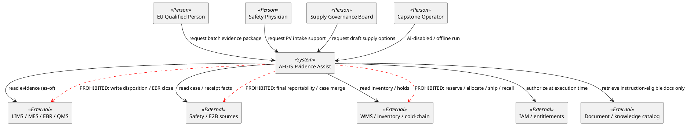
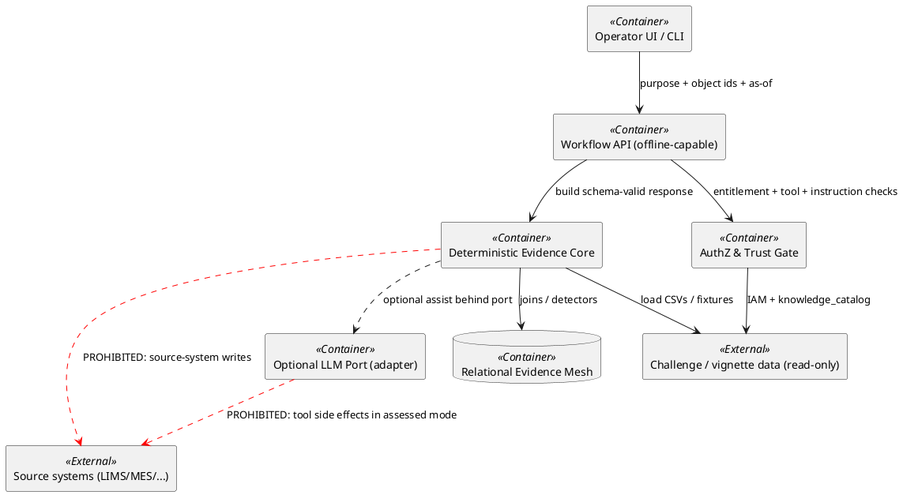
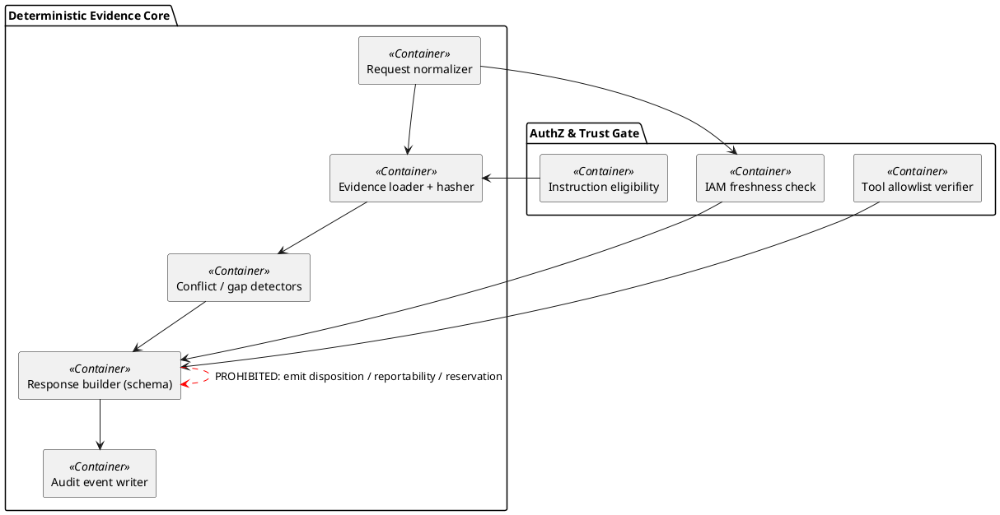

# C4 Architecture

> Phase 3. Advisory evidence-reconciliation assist. PROHIBITED write paths drawn explicitly.

## Document control

| Field | Entry |
|---|---|
| Team / owner | Team-3 / Architecture–build lead (named TBD) |
| Version / date | 0.1 / 2026-08-10 |
| Reviewers | GxP; Security; Product–value |
| Status | Draft |
| Related requirements / ADRs | FR-B*/P*/S*/T*; DEC-010/020/030–041; INV-01…08 |

## Purpose

Define system context, containers, and critical components for the three fail-closed workflows so regulated authority stays outside the system boundary and offline deterministic mode is first-class.

**Completion:** Every named person/system/container appears in a PlantUML view; PROHIBITED edges are dashed red; maps to bounded contexts (artefact 05).

## Evidence register

| Evidence ID | Source path / record | Authority and effective time | Fact used | Integrity / limitation |
|---|---|---|---|---|
| E-001 | `evaluation/contracts/*.schema.json` | Package contracts | Fail-closed response shapes | Binding |
| E-002 | `starter/contracts/WORKFLOW_CONTRACTS.md` | Package | Workflow I/O bounds | Narrative |
| E-003 | artefact 05 DDD context map | Team | Bounded contexts + INV-* | Draft |
| E-004 | `data/system_inventory.csv` | Case systems | LIMS-4, AI-EVIDENCE, BIOX-ELN | Synthetic |
| E-005 | `data/api_contract_versions.csv` | Interfaces | LIMS v1/v2; E2B_R3 | Synthetic |
| E-006 | DEC-020 / artefact 08 | Team | No KG DB v1 | Decision |
| E-007 | `ai_use_boundaries.csv` / DEC-012 | Boundaries | Prohibited acts | Binding |

## 1. System context

| Item / question | Evidence-based response | Decision / owner | Acceptance evidence |
|---|---|---|---|
| System purpose | Package cited evidence, contradictions, gaps, abstentions for human review | DEC-010 | Contracts E-001 |
| Outside boundary | Batch disposition, ICSR final safety conclusions, stock execution | E-007 | Schema negatives |
| Degraded mode | Deterministic offline path without model calls | FR-T2 | Continuity runbook later |

## 2. Container view

| Container | Bounded contexts (05) | Notes |
|---|---|---|
| Deterministic Evidence Core | Evidence & Provenance; Batch; PV; Supply | Always available offline |
| AuthZ & Trust Gate | Security & Entitlements; Privacy flags | Fail closed |
| Relational Evidence Mesh | Master Data / Identity | No KG DB (DEC-020) |
| Optional LLM Port | none (infrastructure) | Swap/disable without redesign |

## 3. Component view (critical workflow components)

| Component | Responsibility | Prohibited |
|---|---|---|
| Response builder | Emit contract-valid JSON only | `batch_disposition`, `final_reportability`, `reservation_id`, `no_side_effects:false` |
| IAM freshness | Deny revoked/stale | Cache-only allow |
| Tool verifier | Signed allowlist | Blind exec / write tools in assessed mode |
| Instruction eligibility | DEC-022 filter | Untrusted SOP-as-instruction |

## 4. Critical code/sequence view (batch happy + deny)

| Step | Behaviour | Acceptance |
|---|---|---|
| 1 | Receive batch_id, purpose, as_of, user | Required inputs |
| 2 | AuthZ at execution time | Deny if stale/revoked |
| 3 | Load lab/EBR/release evidence; hash integrity | evidence_item |
| 4 | Detect unit/authority/time conflicts | contradictions[] |
| 5 | Build readiness_state; execution_status=not_executed | Schema valid |
| Deny path | Unauthorized / untrusted instruction / unsigned tool | Fail closed; audit |

## 5. Trust and GxP boundaries

| Boundary | Control | Trace |
|---|---|---|
| Authority | Human decides disposition/reportability/allocate | INV-03/04/05 |
| Data integrity | Citations + sha256; source_preserved | INV-01 |
| Units | No silent conversion | INV-02 |
| Knowledge | Instruction-eligible only if approved | INV-06 / DEC-022 |
| Connectivity | Read-only toward source systems | ADR-037 |
| AI | Optional; disabled path required | FR-T2 |

## 6. Data and event flows

| Flow | Direction | Semantics |
|---|---|---|
| LIMS result v1/v2 | Inbound read | ACL maps unit/status fields (artefact 12) |
| MES / EBR / genealogy | Inbound read | Gaps preserved (INV-07) |
| E2B ICSR | Inbound read | Precision variable; no final reportability out |
| IDMP mappings | Inbound read | Identity conflicts surfaced |
| Assist response | Outbound to human | Schema-enforced advisory only |
| Audit | Internal append | request_id, authZ, abstentions |

## 7. Deployment and offline mode

| Item | Choice |
|---|---|
| v1 topology | Single offline package: Python core + local data + optional UI |
| Model dependency | None for assessed deterministic path |
| Secrets | No real credentials; synthetic IAM fixtures |
| Revisit | Split services only when multi-site latency/RTO demands (ADR-041) |

## Risks, assumptions and unresolved gaps

| ID | Type | Description | Impact | Owner | Due / trigger | Status |
|---|---|---|---|---|---|---|
| R-301 | Gap | Named architecture owner TBD (DEC-004) | Review lag | Team | Hour 18 | Open |
| R-302 | Risk | Runtime gates still stubs — tests red by design | POC incomplete until Phase 5 | Architecture | Phase 5 | Open |
| A-016 | Assumption | PlantUML plain shapes sufficient for defence | Render tooling | Architecture | Defence | Open |

## Traceability and acceptance

| Claim / requirement | Architecture or control | Test / evaluation | Evidence path | Result |
|---|---|---|---|---|
| FR-B2 / FR-P2 / FR-S2 | Schema + PROHIBITED edges | `tools/test_contracts.py`; schema tests | evaluation/contracts | PASS (schema) |
| FR-T1 | AuthZ/tool/instruction containers | `test_prohibited_runtime_gates.py` | submission/tests | RED (Phase 3) |
| FR-K1 | Relational mesh container | DEC-020 / ADR-031 | artefact 08 | Accepted |

## Review record

| Reviewer | Role | Finding | Resolution | Date |
|---|---|---|---|---|
| TBD | Architecture peer | Pending Hour-18 sign-off | | |
