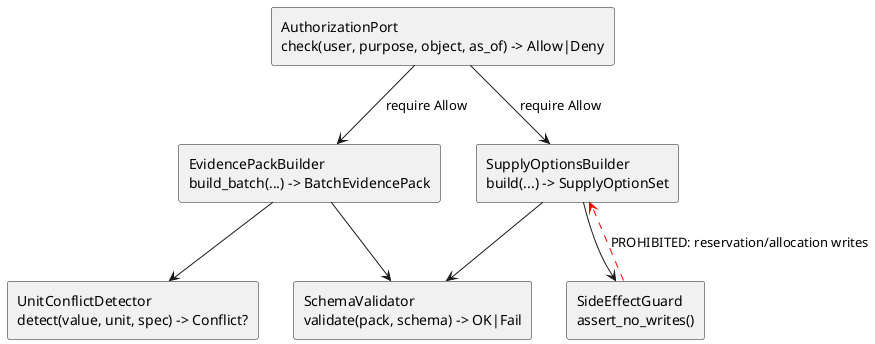

# C4 Level 4 — Code (riskiest paths only)

| Field | Entry |
|---|---|
| Artifact status | **provisional** |
| Depth | Interfaces only — no full module tree |

## Why Level 4 here

Highest hard-gate risk: authZ bypass, silent unit conversion, supply side effects, disposition leakage.

## Proposed module names (submission layout intent — not implementing here)

| Module | Role |
|---|---|
| `submission/src/authz/` | AuthorizationPort |
| `submission/src/evidence/` | ACL loaders, Evidence Items |
| `submission/src/workflows/batch.py` | BatchEvidencePack |
| `submission/src/workflows/pv.py` | PvIntakePacket |
| `submission/src/workflows/supply.py` | SupplyOptionSet + SideEffectGuard |
| `submission/src/contracts/` | SchemaValidator |
| `submission/src/runtime/mode.py` | Mode Controller |
| `submission/src/ports/llm.py` | Narrator Port (no-op default) |

Exact APIs deferred to Prompt 08.
