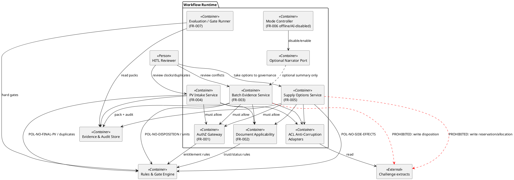

# C4 Level 3 — Components

| Field | Entry |
|---|---|
| Artifact status | **provisional** |
| Focus | Workflow Runtime + Rules engine internals |

## Component diagram (Workflow Runtime)

## Component ↔ BC ↔ FR

| Component | Bounded context | Features |
|---|---|---|
| AuthZ Gateway | BC-AUTHZ | FR-001 |
| Document Applicability | BC-DOCAPPLY | FR-002 |
| Batch Evidence Service | BC-BATCH | FR-003 |
| PV Intake Service | BC-PV | FR-004 |
| Supply Options Service | BC-SUPPLY | FR-005 |
| Mode Controller | Shared continuity | FR-006 |
| Evaluation / Gate Runner | BC-MEASURE | FR-007 |
| ACL Adapters | Supporting / shared | FR-003/004/005 inputs |
| Optional Narrator Port | Gen AI (non-owning) | optional assist only |

## Gen AI runtime sketch (structure only)

| Concern | Where it sits | Default |
|---|---|---|
| Retrieval | DocApp + ACL over approved docs / cited extracts | On (rules-filtered) |
| Model calls | Narrator Port via Model Adapter | **Off** |
| Tools | None with write side effects in assessed mode | Disabled |
| Human review | UI/CLI presentation of Conflicts, Abstentions, required_reviews | Required on high-risk |

ADR candidates justify off-by-default and no write tools (see `adr_candidates.md`).
