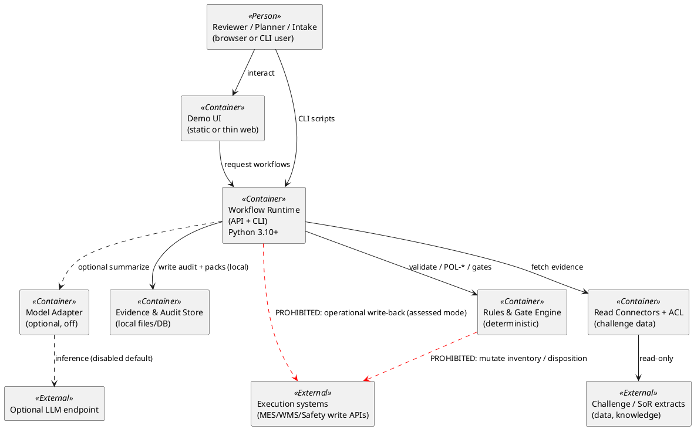

# C4 Level 2 — Containers

| Field | Entry |
|---|---|
| Artifact status | **provisional** |
| Deploy shape | Minimum: local/offline runnable units — no multi-region agent fabric |

## Narrative

Assessed POC uses a small set of containers: a **Demo UI**, a **Workflow API / CLI runtime**, a **Rules & Gate engine**, an **Evidence store** (local), optional **Model adapter** (disabled by default), and **read-only connectors** to challenge data. Side-effecting execution adapters are **not deployed** in assessed mode.

## Container diagram

## Container responsibilities

| Container | Responsibility | BC mapping | FR-IDs |
|---|---|---|---|
| Demo UI | Present packs/options; show deny/quarantine; no silent green “released” | HITL surface | FR-003/004/005 UX |
| Workflow Runtime | Orchestrate minimum governed workflow; modes offline/AI-disabled | All core | FR-001–007 |
| Rules & Gate Engine | AuthZ, doc trust, unit conflict, schemas, release gates | BC-AUTHZ, DOCAPPLY, MEASURE + invariants | FR-001,002,007 + POL in 003–005 |
| Evidence & Audit Store | Persist packs, citations, gates, idempotency keys locally | Shared kernel audit | all |
| Read Connectors + ACL | Translate SoR/CSV language → domain Evidence Items | ACL | FR-003/004/005 |
| Model Adapter | Optional narrator only | Gen AI boundary | optional path of FR-003/004/005; FR-006 off |

## Mapping notes

- No separate “agent swarm” container in provisional map.  
- Evaluation runner may be the same Runtime with `evaluate` entrypoint (FR-007).
