# C4 Level 1 — System Context

| Field | Entry |
|---|---|
| Prompt | `prompts/06_c4.md` |
| Skills | `domain-and-architecture` (C4) |
| Prerequisites | `04_ddd/`, `05_features/feature_index.md` |
| Artifact status | **provisional** (inherited from Prompt 04; not upgraded) |
| Scope | Minimum governed workflow only |

## Narrative

**AEGIS Evidence Assist** is an offline-capable advisory system that helps Quality, PV, and Supply actors assemble cited evidence packs and draft options. It reads brownfield systems of record (or their package extracts), enforces purpose-bound authorization and document applicability, and **never** performs batch certification, final PV decisions, or inventory/allocation execution.

People interact with AEGIS for assist outputs; regulated decisions remain in external human/SoR contexts.

## Context diagram

```plantuml
@startuml
rectangle "Quality / QP support reviewer" <<Person>> as Qual
rectangle "EU Qualified Person" <<Person>> as QP
rectangle "PV intake scientist" <<Person>> as PVSci
rectangle "Safety Physician" <<Person>> as SafPhys
rectangle "Supply planner" <<Person>> as Planner
rectangle "Supply Governance Board" <<Person>> as SGB
rectangle "CISO / IAM admin" <<Person>> as Ciso
rectangle "Evaluation lead" <<Person>> as Eval

rectangle "AEGIS Evidence Assist\n(advisory, offline-capable)" <<System>> as Aegis

rectangle "LIMS / Lab results" <<External>> as Lims
rectangle "MES / EBR / Genealogy" <<External>> as Mes
rectangle "QMS / Deviations / CAPA" <<External>> as Qms
rectangle "Global safety DB / receipts" <<External>> as Safety
rectangle "Inventory / logistics extracts" <<External>> as Inv
rectangle "IAM entitlements" <<External>> as Iam
rectangle "Document control / knowledge catalog" <<External>> as Docs
rectangle "Optional model endpoint" <<External>> as Model

Qual --> Aegis : request BatchEvidencePack
PVSci --> Aegis : request PvIntakePacket
Planner --> Aegis : request SupplyOptionSet
Ciso --> Aegis : entitlement / deny policy
Eval --> Aegis : run gates / export results

Aegis --> Lims : read (ACL)
Aegis --> Mes : read (ACL)
Aegis --> Qms : read (ACL)
Aegis --> Safety : read (ACL)
Aegis --> Inv : read (ACL)
Aegis --> Iam : read Current Entitlement
Aegis --> Docs : read Applicable Documents
Aegis ..> Model : optional narrative (off by default)

Aegis --> Qual : cited pack / conflicts / abstentions
Aegis --> PVSci : intake packet / candidates / clocks
Aegis --> Planner : draft options / constraints

QP --> Qual : uses pack for certification (outside AEGIS)
SafPhys --> PVSci : final PV decisions (outside AEGIS)
SGB --> Planner : allocation approval (outside AEGIS)

Aegis -[#red,dashed]-> QP : PROHIBITED: certify / dispose batch
Aegis -[#red,dashed]-> SafPhys : PROHIBITED: final PV conclusions
Aegis -[#red,dashed]-> Inv : PROHIBITED: reserve / allocate / ship / status change
Aegis -[#red,dashed]-> Mes : PROHIBITED: write disposition to MES/EBR
@enduml
```

## External systems in scope (read)

Package-backed extracts representing LIMS, MES/EBR, QMS, safety, inventory, IAM, document catalog (`data/`, `knowledge/`). Live write integrations are out of assessed POC scope.
